# Architecture Documentation

Technical architecture of the Monobase Infrastructure template.

## Table of Contents

1. [Overview](#overview)
2. [System Architecture](#system-architecture)
3. [Gateway Architecture](#gateway-architecture)
4. [Storage Architecture](#storage-architecture)
5. [Security Architecture](#security-architecture)
6. [Backup Architecture](#backup-architecture)
7. [Monitoring Architecture](#monitoring-architecture)

---

## Overview

### Design Principles

1. **No Overengineering** - Simple, proven technologies for <500 users
2. **Security by Default** - Zero-trust, encryption everywhere
3. **Fork-Based Workflow** - Reusable template, client-specific configuration
4. **Cloud-Native** - Kubernetes-native, CNCF projects preferred
5. **Cost-Effective** - Shared infrastructure, optional components

### High-Level System Architecture

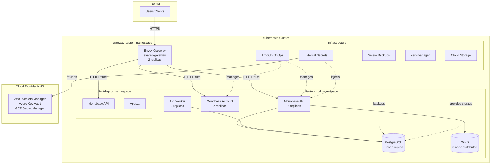

### Technology Stack

**Core (Always Deployed):**
- Kubernetes 1.27+ (EKS, AKS, GKE, or self-hosted)
- Envoy Gateway (Gateway API)
- cloud storage (distributed storage)
- ArgoCD (GitOps)
- External Secrets Operator (KMS integration)
- cert-manager (TLS automation)

**Applications:**
- Monobase API (API backend)
- Monobase Account (Vue.js frontend)
- PostgreSQL 7.x (primary database)

**Optional:**
- API Worker (real-time sync)
- MinIO (self-hosted S3)
- Valkey (Redis-compatible cache)
- Velero (Kubernetes backups)
- Prometheus + Grafana (monitoring)

**NOT Included (Deliberately):**
- ❌ Service Mesh (Istio/Linkerd) - Overkill for 3 services
- ❌ Self-hosted Vault - Use cloud KMS instead
- ❌ Rook-Ceph - cloud storage + MinIO simpler

---

## System Architecture

### Request Flow Diagram

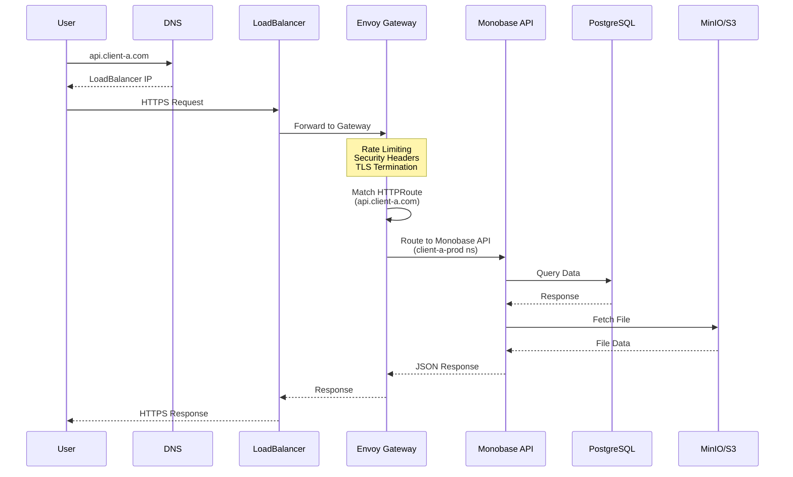

### Multi-Tenant Architecture

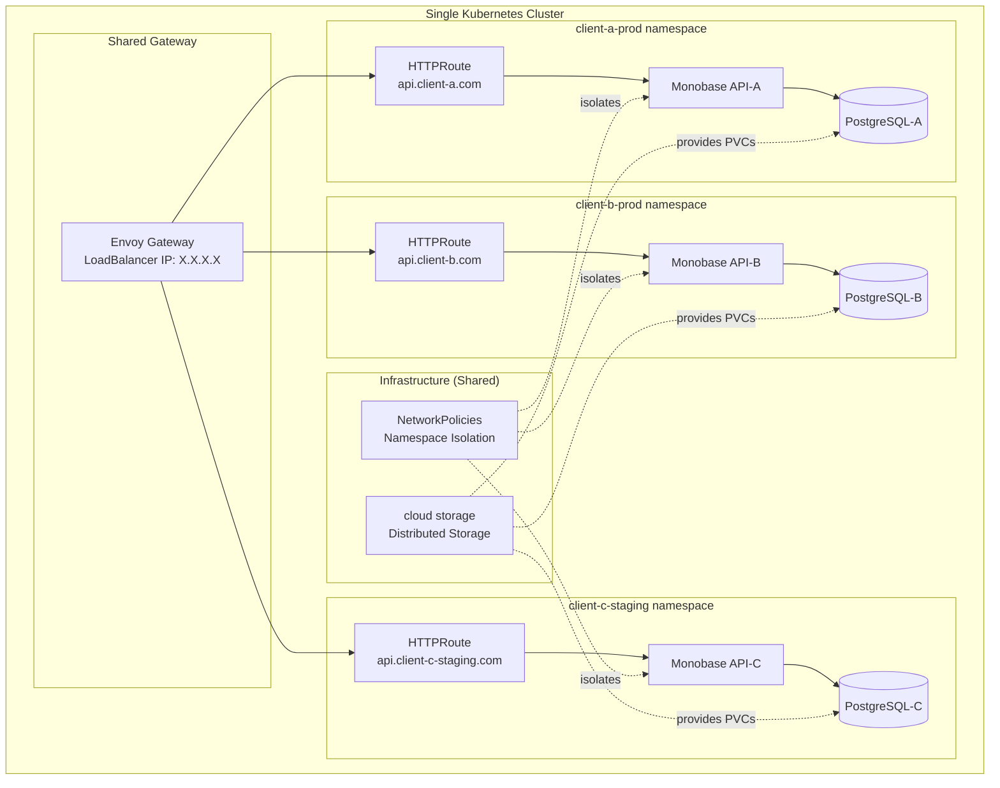

### Component Diagram

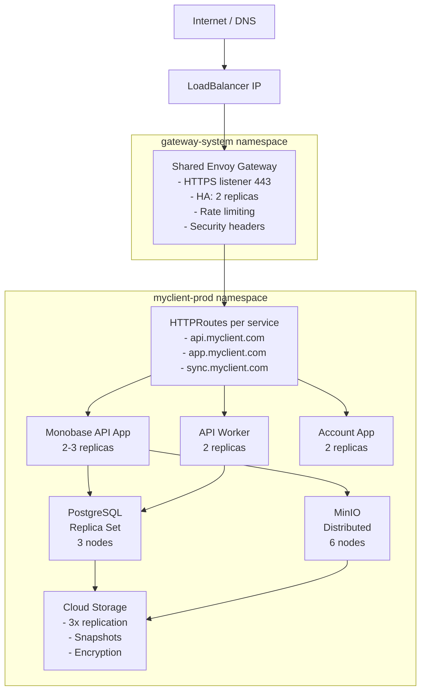

### Data Flow

**1. User Request → Monobase API:**
```
Browser → DNS → LoadBalancer → Gateway (443) 
  → HTTPRoute (api.myclient.com) → Monobase API Service (7500) 
  → Monobase API Pod → PostgreSQL (5432)
```

**2. User Request → Frontend:**
```
Browser → DNS → LoadBalancer → Gateway (443)
  → HTTPRoute (app.myclient.com) → Monobase Account Service (80)
  → Monobase Account Pod (nginx serving static files)
```

**3. File Upload Flow:**
```
Client → Monobase API → MinIO S3 API (9000)
  → Cloud Storage PVC → Cloud provider block storage
```

**4. File Download Flow:**
```
Client → Monobase API (generates presigned URL)
  → Client downloads directly from MinIO via Gateway
  → HTTPRoute (storage.myclient.com) → MinIO (9000)
```

---

## Gateway Architecture

### Shared Gateway Strategy

**Key Decision: 1 Gateway + Dynamic HTTPRoutes**

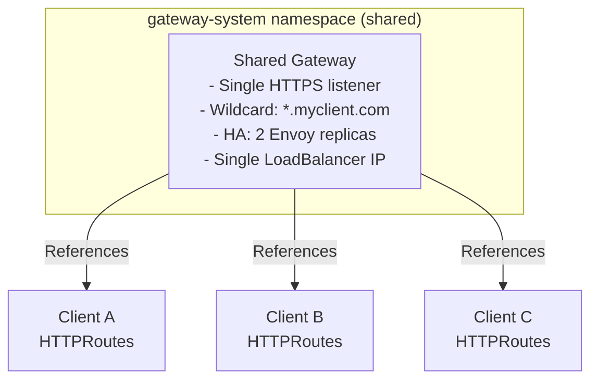

**Benefits:**
- ✅ **Zero-downtime client onboarding** - HTTPRoutes added dynamically
- ✅ **Single LoadBalancer IP** - Cost-effective
- ✅ **Independent routing** - Each client controls their routes
- ✅ **Flexible hostnames** - Any domain per service

**HTTPRoute Pattern:**
```yaml
apiVersion: gateway.networking.k8s.io/v1
kind: HTTPRoute
spec:
  parentRefs:
    - name: shared-gateway  # References shared Gateway
      namespace: gateway-system
  hostnames:
    - api.client.com       # Client-specific domain
  rules:
    - backendRefs:
        - name: api
          port: 7500
```

---

## Storage Architecture

### cloud storage Distributed Block Storage

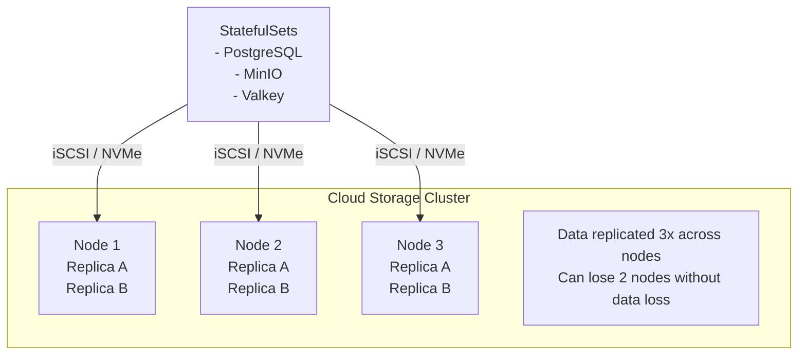

**Features:**
- **3-way replication** - Data on 3 nodes
- **Automatic failover** - Rebuilds replicas on node failure
- **Snapshots** - Hourly local snapshots
- **Backups** - Daily S3 backups
- **Encryption** - dm-crypt volume encryption
- **Expansion** - Online volume resize

### MinIO Distributed Storage (Optional)

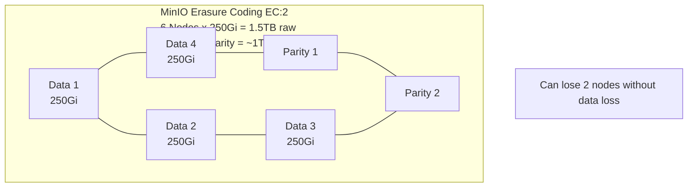

**Why MinIO:**
- S3-compatible API
- No egress fees (self-hosted)
- <1TB data (cost-effective)
- Full control

**Why External S3:**
- >1TB data (scale better)
- Global CDN integration
- Managed service
- Built-in redundancy

---

## Security Architecture

### Zero-Trust Network Model

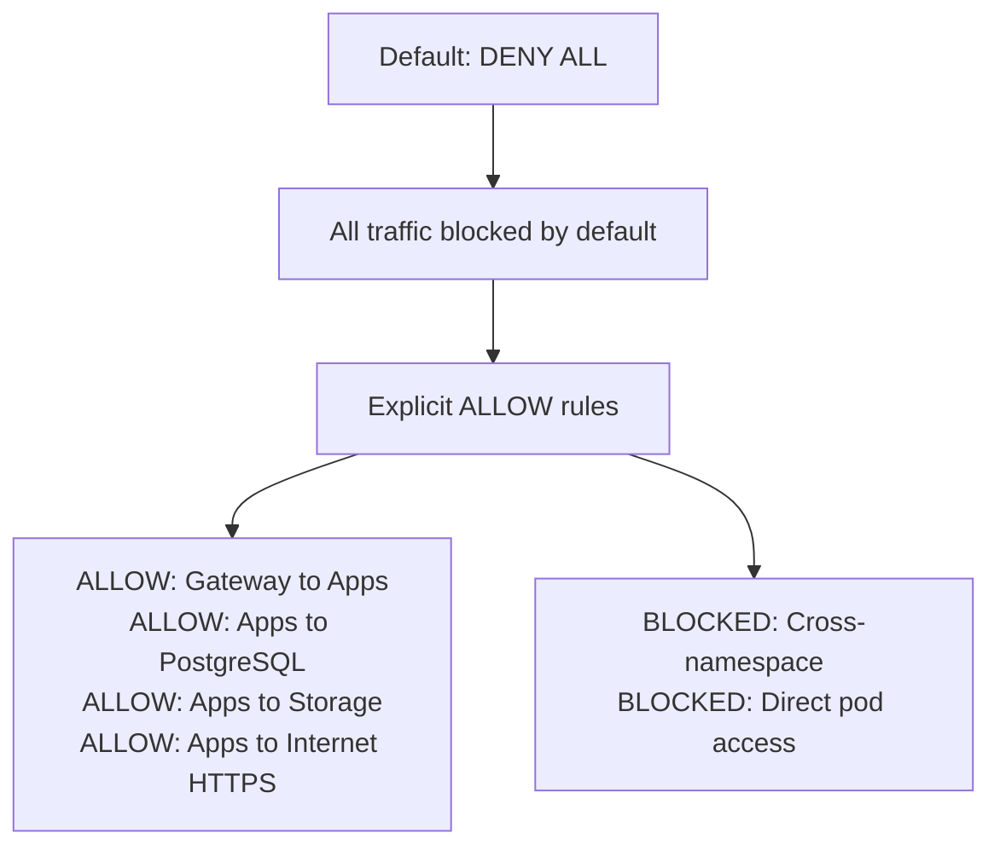

### Defense in Depth

**Layer 1: Network (NetworkPolicies)**
- Default deny all traffic
- Explicit allow rules only
- Cross-namespace isolation
- DNS and K8s API allowed

**Layer 2: Pod (Pod Security Standards)**
- Non-root containers
- No privilege escalation
- Drop ALL capabilities
- Read-only root filesystem
- seccomp profile enforced

**Layer 3: Application (RBAC)**
- Dedicated service accounts
- Least-privilege roles
- No default SA usage
- Namespace-scoped permissions

**Layer 4: Data (Encryption)**
- At rest: cloud storage + PostgreSQL encryption
- In transit: TLS everywhere (cert-manager)
- Backups: S3 + KMS encryption

**Layer 5: Access (External Secrets)**
- Secrets never in Git
- KMS integration (AWS/Azure/GCP)
- Automatic rotation
- Audit logging

---

## Backup Architecture

### 3-Tier Backup Strategy

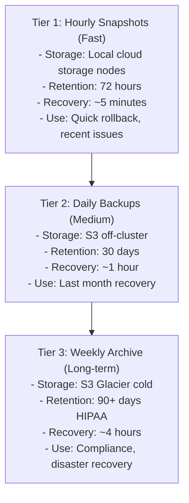

**Backup Methods:**

1. **cloud storage Snapshots** - Volume-level, COW snapshots
2. **Velero Backups** - Kubernetes-native, application-aware
3. **PostgreSQL dumps** - Application-level (optional)

**Recovery Time Objectives (RTO):**
- Tier 1: 5 minutes
- Tier 2: 1 hour
- Tier 3: 4 hours

**Recovery Point Objectives (RPO):**
- Tier 1: 1 hour (max data loss)
- Tier 2: 24 hours
- Tier 3: 1 week

---

## Monitoring Architecture

### Optional Monitoring Stack

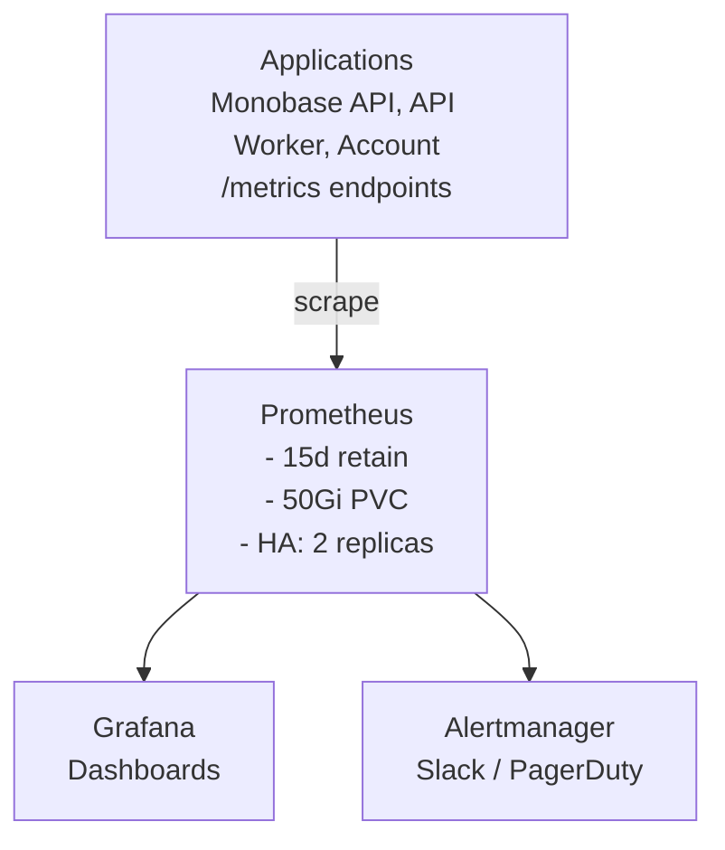

**When to Enable:**
- Production environments
- >100 active users
- After baseline established
- Business-critical services

**Resource Overhead:**
- ~3-5% additional CPU/memory
- ~60Gi additional storage
- Worth it for production visibility

---

## High Availability

### Component HA Strategy

| Component | Replicas | Strategy | Downtime on Failure |
|-----------|----------|----------|---------------------|
| Monobase API | 2-3 | Rolling update + PDB | 0s (other pods serve) |
| Monobase Account | 2 | Rolling update + PDB | 0s |
| API Worker | 2 | Rolling update + PDB | 0s |
| PostgreSQL | 3 | Replica set | <30s (auto-failover) |
| MinIO | 6 | Erasure coding | 0s (2 node tolerance) |
| Envoy Gateway | 2 | Anti-affinity | <1s (pod swap) |
| cloud storage | 3 | Volume replication | 0s (auto-rebuild) |

### Update Strategy

**Zero-Downtime Updates:**
1. Rolling update with `maxSurge: 1`, `maxUnavailable: 0`
2. PodDisruptionBudget ensures `minAvailable: 1`
3. Health checks prevent unhealthy pod traffic
4. Gateway routes to healthy pods only

**Example Update:**
```
Before: Pod A (v1), Pod B (v1)
Step 1: Pod A (v1), Pod B (v1), Pod C (v2) ← new pod
Step 2: Pod A terminating, Pod B (v1), Pod C (v2)
Step 3: Pod B (v1), Pod C (v2), Pod D (v2) ← new pod
Step 4: Pod B terminating, Pod C (v2), Pod D (v2)
After: Pod C (v2), Pod D (v2) ← 100% v2, zero downtime
```

---

## Namespace Architecture

### Per-Client + Per-Environment Isolation

```mermaid
graph TB
    Cluster["Cluster"]

    GWSys["gateway-system (shared)<br/>shared-gateway, 1 Gateway, HA: 2 replicas"]
    CloudSys["cloud-default-system (shared)<br/>cloud storage components"]
    ExtSec["external-secrets-system (shared)<br/>External Secrets Operator"]
    VeleroNS["velero (shared)<br/>Velero backup controller"]
    ArgoNS["argocd (shared)<br/>ArgoCD components"]
    MonNS["monitoring (shared, optional)<br/>Prometheus + Grafana"]

    ClientAProd["client-a-prod<br/>api, api-worker, account<br/>postgresql, minio, valkey<br/>HTTPRoutes to shared-gateway"]
    ClientAStag["client-a-staging<br/>api, account<br/>postgresql<br/>HTTPRoutes to shared-gateway"]
    ClientBProd["client-b-prod<br/>api, api-worker, account<br/>postgresql, minio<br/>HTTPRoutes to shared-gateway"]

    Cluster --> GWSys
    Cluster --> CloudSys
    Cluster --> ExtSec
    Cluster --> VeleroNS
    Cluster --> ArgoNS
    Cluster --> MonNS
    Cluster --> ClientAProd
    Cluster --> ClientAStag
    Cluster --> ClientBProd
```

**Benefits:**
- **Isolation** - Each client in separate namespace
- **Security** - NetworkPolicies prevent cross-namespace traffic
- **Resource Control** - ResourceQuotas per namespace
- **Independent Scaling** - Scale clients independently
- **Cost Allocation** - Track resources per client

---

## Security Zones

### Zone Model

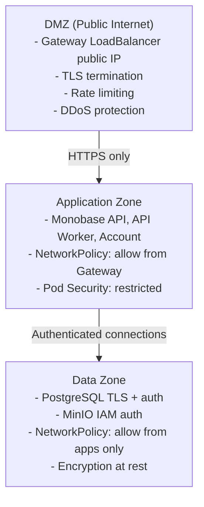

---

## Disaster Recovery

### RTO/RPO Targets

| Scenario | RTO | RPO | Recovery Method |
|----------|-----|-----|-----------------|
| Pod failure | 0s | 0 | Auto-restart + HA |
| Node failure | <30s | 0 | Pod rescheduling |
| AZ failure | <5min | 1h | cloud storage snapshot restore |
| Database corruption | <1h | 24h | Velero daily backup |
| Cluster failure | <4h | 1w | Velero weekly + new cluster |
| Region failure | <8h | 1w | Cross-region backup restore |

### Failure Scenarios

**1. Single Pod Failure:**
- **Detection:** Health check fails
- **Action:** Kubernetes restarts pod automatically
- **Impact:** None (other replicas serve traffic)
- **RTO:** <30s

**2. Node Failure:**
- **Detection:** Node goes NotReady
- **Action:** Pods rescheduled to healthy nodes
- **Impact:** Brief degradation if node had replicas
- **RTO:** 1-5 minutes
- **cloud storage:** Rebuilds volume replicas automatically

**3. PostgreSQL Replica Failure:**
- **Detection:** Replica set monitoring
- **Action:** Automatic failover to secondary
- **Impact:** <30s connection interruption
- **RTO:** <30s

**4. Complete Cluster Failure:**
- **Detection:** All nodes down
- **Action:** Restore to new cluster from Velero backup
- **Impact:** Full outage during restore
- **RTO:** 2-4 hours
- **RPO:** Last successful backup (24h max)

---

## Scalability

### Horizontal Scaling

**Application Pods (via HPA):**
```
Traffic increases → CPU >70% → HPA adds pods
  → More replicas → CPU normalizes → Stable
```

**Storage (via Volume Expansion):**
```
Storage fills → Expand PVC → cloud storage expands volume
  → No downtime → More space available
```

### Scaling Limits (Current Architecture)

| Component | Max Replicas | Bottleneck |
|-----------|--------------|------------|
| Monobase API | 10 | PostgreSQL connections |
| Monobase Account | 20 | None (stateless) |
| API Worker | 5 | WebSocket connections |
| PostgreSQL | 5 | Replication overhead |
| MinIO | 16 | Erasure coding limit |

**For >500 users:**
- Add PostgreSQL sharding
- Add read replicas
- Consider external S3
- Add caching layer (Redis)

---

## Summary

The Monobase Infrastructure template provides:

✅ **Modern Architecture** - Gateway API, GitOps, cloud-native
✅ **High Availability** - Multi-replica, auto-failover, zero-downtime
✅ **Security** - Zero-trust, encryption everywhere
✅ **Disaster Recovery** - 3-tier backups, tested procedures
✅ **Scalability** - HPA, storage expansion, multi-tenant
✅ **Observability** - Metrics, logs, alerts, dashboards

**Target:** <500 users, <1TB data per client
**Architecture:** Simple, proven, production-ready

For detailed operational procedures, see:
- [DEPLOYMENT.md](../getting-started/DEPLOYMENT.md) - Deployment steps
- [STORAGE.md](../operations/STORAGE.md) - Storage operations
- [BACKUP_DR.md](../operations/BACKUP_DR.md) - DR procedures
- [SCALING-GUIDE.md](../operations/SCALING-GUIDE.md) - Scaling guide
