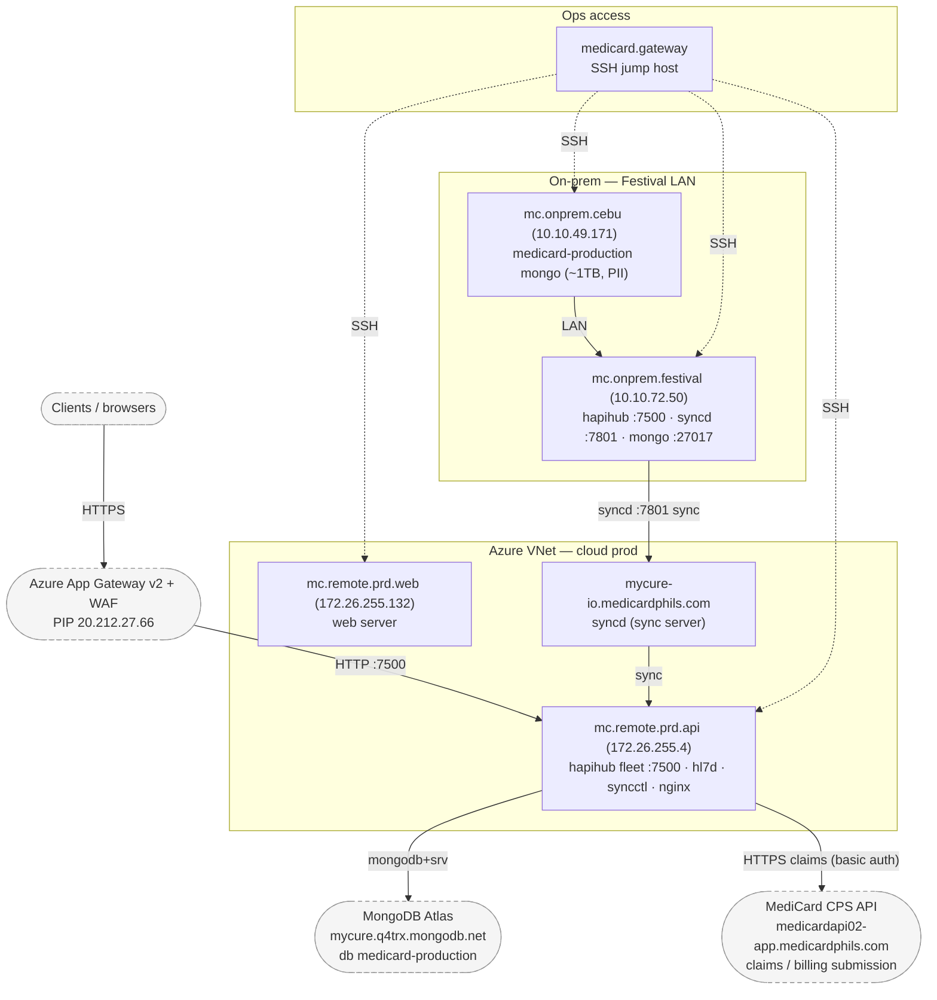
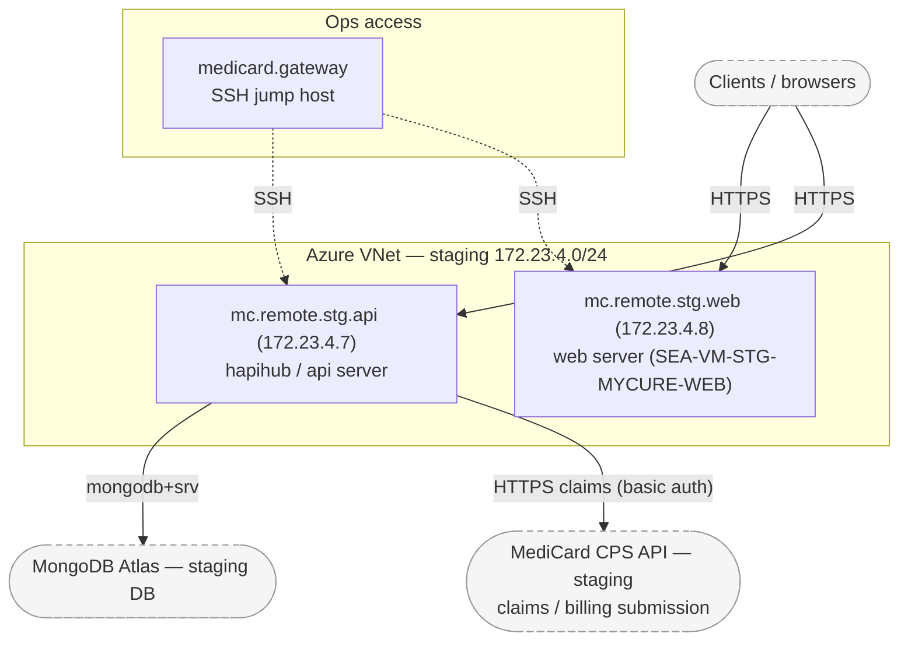
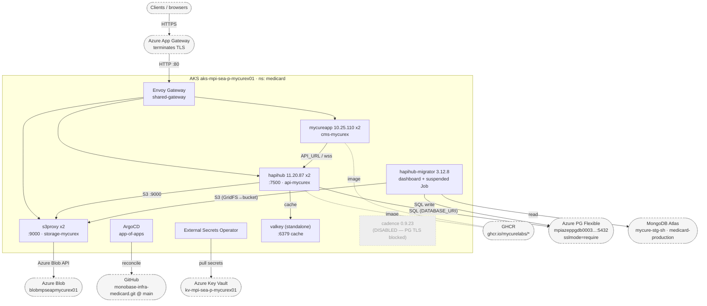
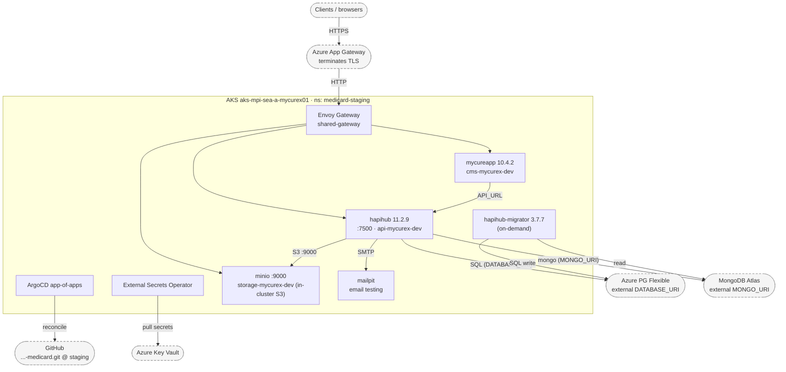

# MediCard Topology — Legacy vs. K8s (prod + staging)

Scope: only MediCard-owned components. Everything we don't run — we reach it
through its provided interface (API / connection string / S3 endpoint) — is drawn
as a **blackbox** (`([ ... ])`, dashed). We don't model their internals.

Sources: `values/deployments/medicard.yaml` (prod, `main`) and the same file on
the `staging` branch.

Legend:
- Solid box = we run/operate it.
- `([blackbox])` dashed = external, accessed only via its connection method.
- Edge labels = the actual protocol/port/URI used.

---

## 1. Legacy — Production

Reached for ops via the `medicard.gateway` jump host (VPN). Real client traffic
enters through Azure's App Gateway + WAF, which forwards straight to hapihub
`:7500` (bypasses local nginx). hapihub runs the **MediCard CPS integration
plugin** (`apid-plugin-medicard-cps`), which submits claims/billing to MediCard's
CPS API.

---

## 2. Legacy — Staging

Same jump-host access pattern; two dedicated staging VMs. DB backing follows the
prod pattern — a MongoDB Atlas staging database — and hapihub runs the same
MediCard CPS integration plugin against MediCard's CPS staging API.

---

## 3. K8s — Production

Azure AKS `aks-mpi-sea-p-mycurex01` (southeastasia, **private link** — API server
only reachable in-VNet, hence the bastion). GitOps via ArgoCD app-of-apps tracking
`main`. hapihub is **PostgreSQL-only** (external Azure PG); object storage is
s3proxy translating S3→Azure Blob. Mongo appears only as the migrator's source.

---

## 4. K8s — Staging

Same AKS/GitOps model, `staging` branch → ns `medicard-staging`, domain
`*-mycurex-dev`. hapihub (11.2.9) serves the API against external Azure PG
(`DATABASE_URI`) and external Mongo / Atlas (`MONGO_URI`); mycureapp (10.4.2) is
the CMS frontend. In-cluster data services are **MinIO** (S3 storage) and
**Mailpit** (email testing), with hapihub-migrator (3.7.7) run on-demand.

---

## Blackboxes (external — accessed only via the listed interface)

| Blackbox | Interface we use | Used by |
|---|---|---|
| MediCard CPS API | HTTPS REST (basic auth) — claims/billing submission | legacy hapihub CPS plugin (prod + staging) |
| MongoDB Atlas | `mongodb+srv://` conn string | legacy hapihub; k8s staging hapihub (`MONGO_URI`); k8s migrator source (both envs) |
| Azure PG Flexible Server | `postgres://…?sslmode=require` | k8s hapihub / migrator (both envs) |
| Azure Blob | Azure Blob API (via s3proxy) | k8s **prod** storage only (staging uses in-cluster MinIO) |
| Azure Key Vault | ESO ClusterSecretStore (`azure-secretstore`) | k8s both envs |
| Azure App Gateway + WAF | HTTPS in → HTTP to our edge | all client-facing traffic |
| GHCR | image pulls | k8s workloads |
| GitHub (infra repo) | ArgoCD reconcile | k8s GitOps |
