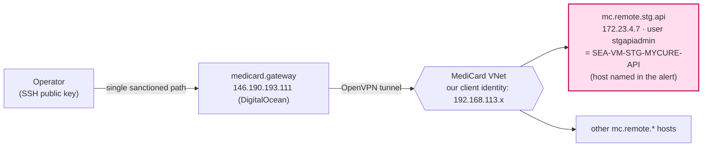
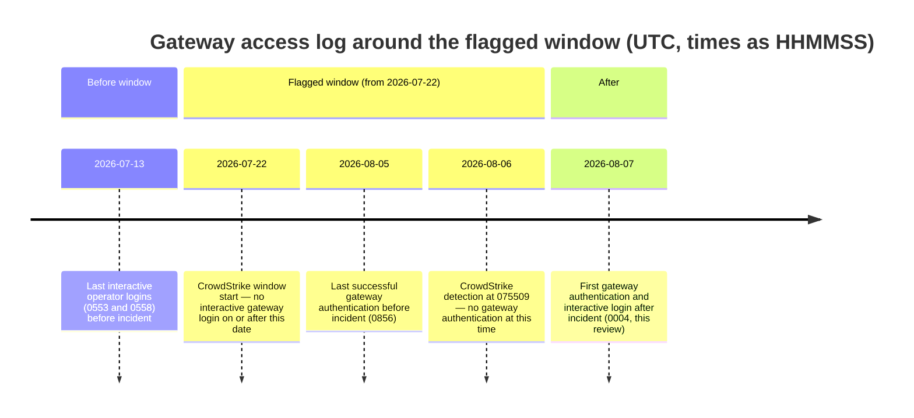
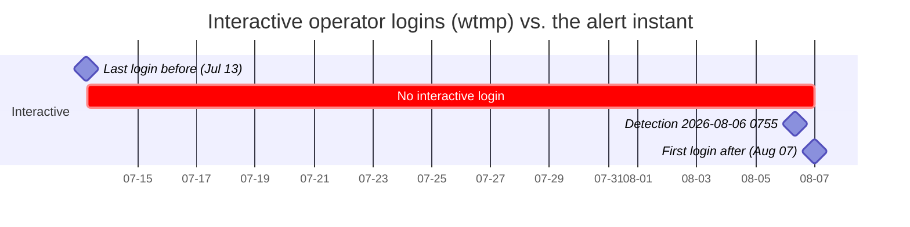
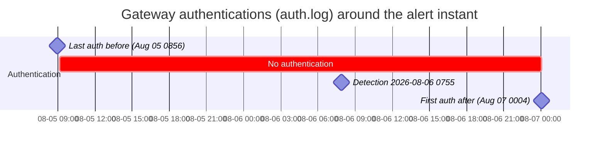

# 2026-08-07 — Gateway access facts for the CrowdStrike escalation on `SEA-VM-STG-MYCURE-API` / `stgapiadmin`

**Author:** MyCure Engineering
**Type:** Observational — access-log facts only. No interpretation or conclusions are drawn here.
**Subject host (per alert):** `SEA-VM-STG-MYCURE-API` (`172.23.4.7`), user context `stgapiadmin`
**Alert reference:** CrowdStrike Falcon detection reported 2026-08-06 07:55:09 UTC; MediCard/MyCure emails and Viber messages, 2026-08-06

---

## 1. Purpose and scope

On 2026-08-06 we were asked to confirm whether activity on the host `SEA-VM-STG-MYCURE-API` under the user context `stgapiadmin` — flagged by CrowdStrike as enumeration / credential-harvesting, reportedly occurring since 2026-07-22, with a detection timestamp of 2026-08-06 07:55:09 UTC — corresponds to our access.

This report states what our access logs show. **All of our access into the MediCard network is made through a single sanctioned gateway** (`medicard.gateway`). This report is scoped to that gateway's own logs. It records observations only.

## 2. Our access path

- We reach the MediCard network exclusively through our gateway host `medicard.gateway`.
- From that gateway we connect over VPN into the MediCard VNet, where our client identity is `192.168.113.x`.
- The host in the alert, `172.23.4.7` (user `stgapiadmin`), is configured on the gateway as the SSH alias `mc.remote.stg.api`.



## 3. Interactive operator logins to the gateway (the flagged window)

Source: the gateway login accounting database `/var/log/wtmp` (read with `utmpdump`). The file is continuous from 2024-10-16 to 2026-08-07 with no rotation gap.

Interactive (pty) operator logins in and around the flagged window:

| Login time (UTC) | Note |
|---|---|
| 2026-06-22 05:19:13 | prior session |
| **2026-07-13 05:53:59** | **last interactive login before the incident** |
| **2026-07-13 05:58:04** | (same day) |
| — | **no interactive login between 2026-07-13 and 2026-08-07** |
| 2026-08-07 00:04:28 | first interactive login after the incident (during this review) |

There were **no interactive operator logins to the gateway during 2026-07-22 → 2026-08-06** (the window CrowdStrike reports). The last interactive session before the incident was 2026-07-13; the next was 2026-08-07.

This is corroborated by two independent subsystems on the gateway for the same window:
- systemd journal `sshd` PAM session records, and
- systemd `logind` "New session" records.

Both show no interactive operator session between 2026-07-13 and 2026-08-07.

## 4. Gateway activity at the alert timestamp

Source: gateway `sshd` authentication log (`/var/log/auth.log*`), successful public-key authentications from our operator IP:

```
2026-08-05T08:56:40Z   Accepted publickey for root   ← last successful auth before the incident
      ‹ no successful authentication for ~39 hours ›
2026-08-07T00:04:27Z   Accepted publickey for root   ← next successful auth (this review)
```

At the reported detection time **2026-08-06 07:55:09 UTC**, the gateway shows **no SSH authentication of any kind** — neither interactive (§3) nor non-interactive. The gateway had no successful session between 2026-08-05 08:56:40 UTC and 2026-08-07 00:04:27 UTC.

## 5. Deploy / access commands in shell history

The gateway's interactive shell history (`~/.bash_history`) contains, among other entries:
- `rsync -avz --progress hapihub_linux_amd64_5.220.77.tgz mc.remote.stg.api:/srv/http/current`
- multiple `ssh mc.remote.stg.api` invocations.

Facts about these entries:
- The history file carries **no timestamps**: `HISTTIMEFORMAT` is unset and the file contains zero `#<epoch>` timestamp lines. Command order in the file is not a reliable time order.
- `~/.bash_history` is written by **interactive** login shells. Non-interactive `ssh gateway "<command>"` invocations do not write to it.
- The most recent interactive session on the gateway prior to the incident ended on **2026-07-13** (§3).

Accordingly, these commands were entered in an interactive session on or before 2026-07-13. Their exact dates are not recorded on the gateway.

## 6. Evidence basis

- All observations are read-only from the gateway `medicard.gateway`.
- Sources: `/var/log/wtmp` (via `utmpdump`); `/var/log/auth.log*`; systemd journal (`sshd` and `logind`). Journal coverage begins 2026-05-31; `wtmp` coverage is continuous from 2024-10-16.
- Three independent subsystems (wtmp, journald `sshd`, journald `logind`) agree on the interactive-session timeline in §3.
- We did **not** connect to or query the subject host `172.23.4.7`. It is under isolation/forensic review; we deliberately avoided any action against it.

## 7. Data not available from our side

The source IP and timestamps of the `stgapiadmin` sessions on `172.23.4.7` are recorded on that host itself (`/var/log/auth.log` and any endpoint/EDR telemetry on the VM), not on our gateway. Our VNet client identity for cross-referencing is `192.168.113.x`.

---

## Appendix — observed timeline (UTC)

| Time | Observation (gateway logs) |
|---|---|
| 2026-07-13 05:53 / 05:58 | Last interactive operator logins before the incident |
| 2026-07-22 | Start of window per CrowdStrike report — no interactive gateway login on/after this date until 2026-08-07 |
| 2026-08-05 08:56:40 | Last successful gateway authentication before the incident |
| 2026-08-06 07:55:09 | CrowdStrike detection timestamp — no gateway authentication at this time |
| 2026-08-07 00:04:27 / 00:04:28 | First gateway authentication and interactive login after the incident (this review) |

### Timeline (gateway log events)



### Gateway session availability (UTC)

Interactive operator logins (`wtmp`) — full window view:



Successful authentications (`auth.log`) — zoomed to the incident days:


